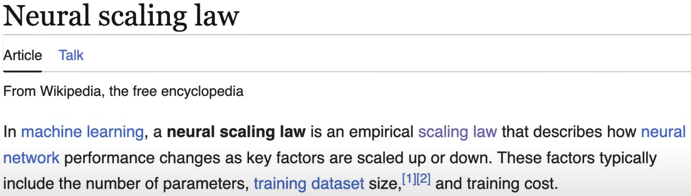

# Understanding Model Distillation in Machine Learning

## Introduction

Distillation is one of the most fascinating techniques in machine learning. Imagine being able to take the best available model and run it on your phone without an internet connection. This would be remarkable because it would mean that such powerful technology could run on hardware with limited performance capabilities. Additionally, it would give users complete control over their data since the data would remain on their devices, making them independent from companies that produce and provide these artificial intelligence models.

## How Neural Networks Work

Before understanding distillation, we need to review how artificial neural networks function. 

An artificial neural network is a mathematical model with computational units called neurons that perform calculations (typically multiplications). These neurons can be arranged in series and parallel, forming different layers. For example, we might have a neural network with 100 layers, each containing 50 neurons, resulting in 5,000 neurons and 252,450 parameters (weights and biases).

### The Learning Process

Neural networks can be applied to countless problems. The key concept is that each problem can be described by data, which is the foundation of machine learning. This means describing the world (or the part of the world you're interested in) through data and transforming this data into numbers.

For example, in image recognition:

1. **Input**: When we input an image of a dog, we're actually providing a set of numbers indicating the amount of red, blue, and green in each pixel that together form the image of the dog or cat.
2. **Processing**: These numbers are processed through the network's parameters.
3. **Output**: The output consists of scores associated with each class (e.g., "dog" and "cat"). These scores can be interpreted as probabilities.

During training, the model adjusts its parameters to maximize the score for the correct class and minimize the score for incorrect classes.

### The Challenge of Neural Networks

By definition, artificial neural networks are sub-optimal initially. They start with no knowledge of the world and random initialization, so in the early epochs of training, the model makes many mistakes. It might initially create a unique internal representation for each image, which is inefficient because it doesn't capture similarities between dogs of the same breed photographed from different angles.

As training progresses, the model learns patterns—characteristics related to dogs and cats—and condenses its internal representation. We can imagine different regions of its internal space occupied by different dog breeds and other distant regions occupied by different cat breeds.

By the end of training, when the network performs well, there's a dense internal arrangement where similar inputs are represented similarly, leading to similar predictions. This is a winning strategy for the network because it only needs to refine parameters related to that region of space, resulting in more stable behavior.

## The Need for Large Models

<!--  -->

The reason for this technical explanation is to illustrate that if the network didn't have enough representation space in the early epochs, it couldn't learn at all. It wouldn't have the ability to arrange so much information about a world it doesn't know and is learning to operate in.

This principle applies not only to computer vision but also to natural language processing, where words or tokens are represented by numbers that are multiplied and summed within the network.

This is one reason why, when dealing with complex problems like modeling language and producing coherent texts in a conversation, networks with many parameters are necessary. They need to learn an enormous quantity of patterns that allow them to be versatile and have appropriate behavior for millions of situations.

### Scaling Laws

Since 2018, there has been scientific evidence that the larger a language model is, the better the quality of its responses. This is related to what was discussed earlier: the larger the model, the more space it has to represent information—potentially information about the entire world, since the training dataset of LLMs covers much of human knowledge.

## The Problems with Large Models

This approach has practical problems:

1. **Size**: Models are gigantic, with hundreds of billions of parameters.
2. **Training Time**: It takes months of training, consuming large amounts of electricity to keep servers running.
3. **Hardware Requirements**: Thousands of graphics cards are needed to process these billions of parameters in fractions of a second.

The cost problem, besides being an economic issue, is also an ethical one because the electricity used is likely produced by creating pollution and taking it away from potentially more virtuous industrial processes or social activities.

## The Solution: Distillation

Distillation is a machine learning technique inspired by how we learn and teach each other. We can make an analogy with the school system: when a school system is built, decisions are made about which parts of history and culture should be taught to children. Not every possible page of the encyclopedia is taught; a filter is applied to the important things.

If a child didn't go to school, they might learn some of the information on their own, but certainly not everything. Think of all the mathematical and physical theories, psychological theories, and all the science for which millennia were necessary, with scientists building upon each other's discoveries. In 2025, we inherit all that work and avoid having to do all the thinking. We don't all need to be geniuses to have the knowledge discovered by a genius because the genius was needed to make that scientific discovery, but then we inherited it.

### The Teacher-Student Model

Similarly, when using distillation, a "genius" model is identified—a model that performs very well, typically a very large model with many parameters. A smaller model is placed alongside it; this smaller model could not achieve the quality of the large one if trained with traditional machine learning techniques.

These two models form a "teacher-student" pair, where the teacher is the large model and the student is the small one. The student is trained from the first epoch to reproduce the teacher's output, avoiding the need for all those neurons that would allow it to learn on its own.

### Practical Implementation

In practice, how this is done depends on who's doing it. Using the previous example:

1. **With Full Access**: If a researcher has a giant network that discriminates between millions of existing animal species and also has the dataset, they take a smaller network (the student), the large network (the teacher), and couple inputs and outputs. The student is told, "Look, the teacher responded with these numbers, assigning a score of 92 to Siamese cat, a score of X to ladybug," and so on. With access to both models and the dataset, the researcher can work on individual predictions for each class to obtain a smaller model that mimics the behavior of the large model.

2. **With Limited Access**: In the case of distillation from one LLM to another, a 70-billion-parameter model from OpenAI might be used as a teacher to train a small 1-billion-parameter model in a European research laboratory. In this case, the European lab doesn't have access to the OpenAI model but has access to its outputs. Given a phrase, they see how the model continues the conversation, which can set up a simple or complicated conversation depending on the phrase. The European lab collects millions of responses from the OpenAI model. In this way, they can only send an input and see the output without seeing the score assigned to each word in the vocabulary, but this is enough for distillation. In a slightly less precise way, because they don't have the scores related to words but only the predicted words, they try to take the student model and say, "Look, behave like the teacher."

## Summary

Distillation is the technique by which smaller models exist today that perform much better than large models that were available two years ago. This is because each time a large model reached a new standard, improving the state of the art, this high-performing model was used through distillation to obtain a new reduced-size model that surpassed the large model of the previous generation.

Another thing we've learned is that in distillation, the student model is not trained from scratch; it doesn't learn on its own but is guided during learning by the teacher model that shows it how to behave in that situation. It's as if humanity is creating a chain of knowledge where each generation of artificial intelligence models can benefit from previous ones, just as we do with culture.
